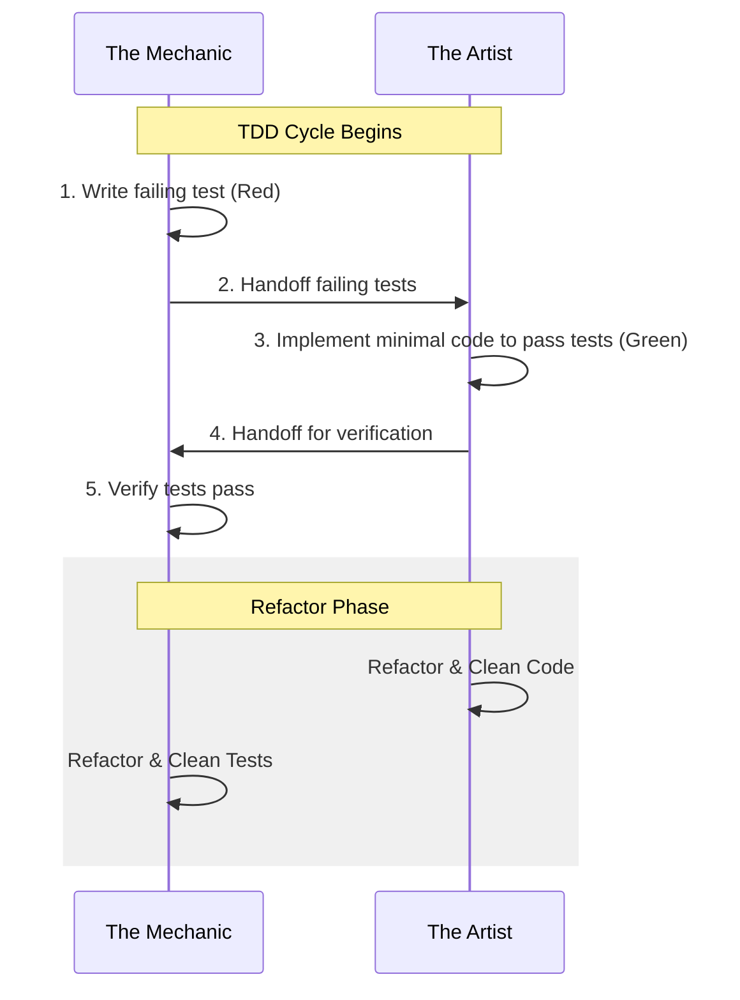

# TDD Pair Programming Protocol

This skill dictates how **The Artist** (implementation) and **The Mechanic** (testing) pair up to implement features and bugfixes using the red-green-refactor loop.

---

## The Ping-Pong Loop

---

## 1. Red Phase: The Mechanic Leads
*   **Action:** **The Mechanic** writes failing Rust tests (or integration test cases) defining the expected behavior.
*   **Constraint:** Write only minimal stubs in the implementation code so the project compiles, but the tests fail.
*   **Handoff:** Declare the tests ready and hand off the workspace/branch to **The Artist**.

## 2. Green Phase: The Artist Takes Over
*   **Action:** **The Artist** writes the implementation code.
*   **Constraint:** The goal is to make **The Mechanic's** tests pass with the simplest, cleanest code possible. Do not over-engineer; focus on solving the test failures.
*   **Handoff:** Once all tests pass locally (`cargo test`), hand back to **The Mechanic**.

## 3. Refactor Phase: Joint Review
*   **Action:** Both agents refactor.
    *   **The Artist** refactors the code for structure, efficiency, and standards.
    *   **The Mechanic** optimizes the test structure, ensures edge cases are covered, and guarantees clean test suites.
    *   **The Critic** checks both files, yelling about any style or layout issues.
*   **Goal:** Ensure the code is clean, idiomatic, and satisfies the definition of done (e.g. `bash scripts/devops-validate.sh` passes).
