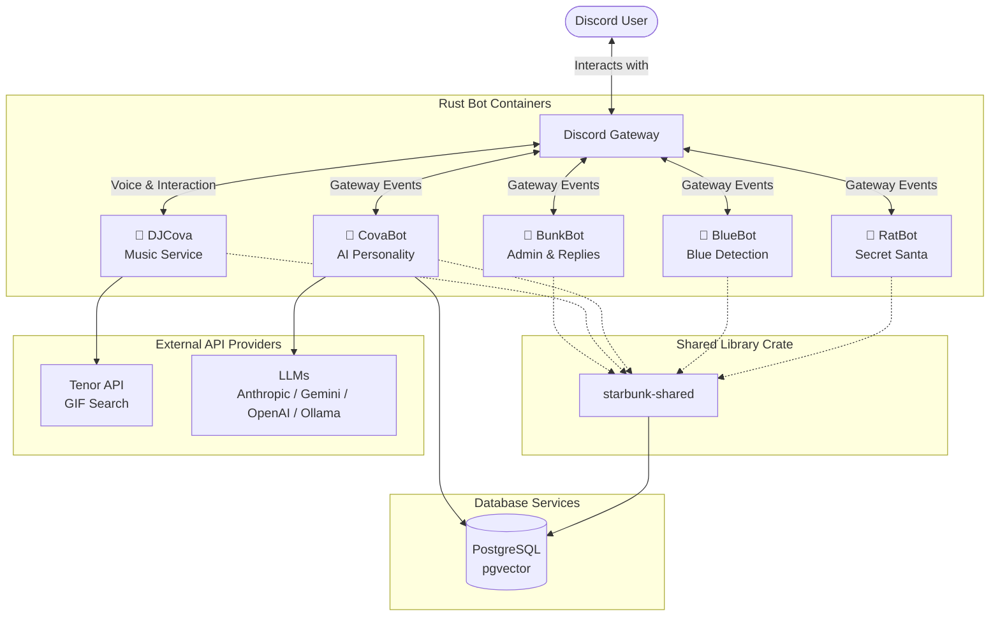

# Starbunk-Rs — Discord Bot System (Rust Monorepo)

A sophisticated, containerized Discord bot system built with **Rust** inside a single Cargo workspace, providing isolated, high-performance services for different bot functionalities. This is the Rust rewrite/port of [starbunk-js](https://github.com/andrewgari/starbunk-js) and [starbunk-go](https://github.com/andrewgari/starbunk-go), optimized for memory safety, concurrency, and speed.

---

## 🏗️ Monorepo Container Architecture

`starbunk-rs` is structured as a Cargo workspace housing 5 independent Discord bots (as individual crates) and a shared library crate. Each bot runs in its own lightweight, unprivileged Docker container:

### 🤖 **BunkBot** (`crates/bunkbot`)
- **Purpose**: Administrative backbone and general reply bot.
- **Features**: Fast message reaction, high-throughput webhook management, admin command dispatch.
- **Resource Profile**: Extremely lightweight, optimized for high event volume.

### 🎵 **DJCova** (`crates/djcova`)
- **Purpose**: Voice channel music streaming service.
- **Features**: Plays YouTube audio via `songbird` and `yt-dlp`, interactive button panels (Stop/Skip/Restart/Re-queue), random dancing GIFs (Tenor API), and auto-disconnect idle timers.
- **Resource Profile**: CPU-intensive (requires `ffmpeg` and python for yt-dlp inside its container).

### 🧠 **CovaBot** (`crates/covabot`)
- **Purpose**: AI personality emulator that responds when mentioned.
- **Features**: Mimics specific users' tone using LLMs, keeps chat context histories, uses `pgvector` semantic memory, and supports OpenAI, Anthropic, Gemini, and Ollama backends.
- **Resource Profile**: Moderate memory usage for context tracking and vector search queries.

### 💙 **BlueBot** (`crates/bluebot`)
- **Purpose**: Pattern-matching bot.
- **Features**: Automatically detects references to "blue" or Blue Mage and replies with contextual or character-themed responses.
- **Resource Profile**: Extremely lightweight.

### 🎁 **RatBot** (`crates/ratbot`)
- **Purpose**: Secret Santa organizer for the guild's "Ratmas" gift exchange.
- **Features**: Handles registrations, randomly assigns gifters, and privately notifies participants via DM.
- **Resource Profile**: Very lightweight, runs on-demand/seasonal.

### 📦 **Starbunk Shared** (`crates/starbunk-shared`)
- Shared library containing reusable messaging abstraction (`MessageService`), webhooks management, composable message filters (combinators like `all_of`/`any_of`), memory layers (`pgvector`), and the Strategy pattern dispatcher (`ReplyBot`).

---

## 📊 System Architecture Diagram



---

## 🚀 Quick Start

### Prerequisites
- Docker and Docker Compose
- Rust (stable toolchain)
- Discord Bot Token
- Tenor API Key (required for DJCova)

### Development Environment (Local)

1. Clone the repository:
   ```bash
   git clone https://github.com/andrewgari/starbunk-rs.git
   cd starbunk-rs
   ```

2. Copy the environment variables example:
   ```bash
   cp .env.example .env
   # Edit .env with your Discord Token and keys
   ```

3. Spin up the local development containers:
   ```bash
   docker compose -f docker/docker-compose.yml up -d --build
   ```

4. Or run a specific bot directly:
   ```bash
   DISCORD_TOKEN=your_token cargo run --bin bunkbot
   ```

---

## 🛠️ Key Commands

```bash
# Run all workspace unit tests
cargo test

# Check clippy/linter
cargo clippy --all-targets --all-features -- -D warnings

# Format check
cargo fmt --all -- --check

# Check DevOps configuration alignment
bash scripts/devops-validate.sh
```

---

## 📋 Environment Configuration

Create a `.env` file containing the following variables:

```env
# General Bot Token
STARBUNK_TOKEN=your_discord_bot_token

# CovaBot LLM Keys
OPENAI_API_KEY=your_openai_key
ANTHROPIC_API_KEY=your_anthropic_key
GOOGLE_API_KEY=your_google_key
OLLAMA_BASE_URL=http://localhost:11434

# CovaBot LLM Routing Tiers
LLM_TIER_HIGH_PROVIDER=anthropic
LLM_TIER_HIGH_MODEL=claude-3-5-sonnet-latest
LLM_TIER_MEDIUM_PROVIDER=google
LLM_TIER_MEDIUM_MODEL=gemini-1.5-flash
LLM_TIER_LOW_PROVIDER=openai
LLM_TIER_LOW_MODEL=text-embedding-3-small

# DJCova Configuration
TENOR_API_KEY=your_tenor_api_key
DEV_GUILD_ID=your_optional_dev_server_guild_id

# Database Configuration
POSTGRES_USER=starbunk
POSTGRES_PASSWORD=your_secure_password
POSTGRES_DB=starbunk_memory
```

---

## 🗄️ Database Services (PostgreSQL + pgvector)

Persistent memory features (such as CovaBot's semantic facts association) use PostgreSQL equipped with the `pgvector` extension.
- **Service Name**: `postgres` (resolves as `postgres` inside Docker networks).
- **Docker Image**: `pgvector/pgvector:pg16`
- **Volume Mount**: `pgdata` (stores PostgreSQL files locally).

---

## 🔄 CI/CD & Deployments

The repository features automated actions configured in `.github/workflows/`:
- **CI / Pull Request** (`ci.yml`): Runs DevOps validations, lints (`cargo fmt`, `clippy`), and runs unit tests for modified crates only.
- **CD / Main Merge** (`main.yml`): Rebuilds and publishes all 5 bot Docker images to GitHub Container Registry (GHCR), creates a new GitHub Release with semver tags bumped from Conventional Commits, and deploys them to the production server.

---

## 📜 License

This project is licensed under the MIT License - see the LICENSE file for details.
